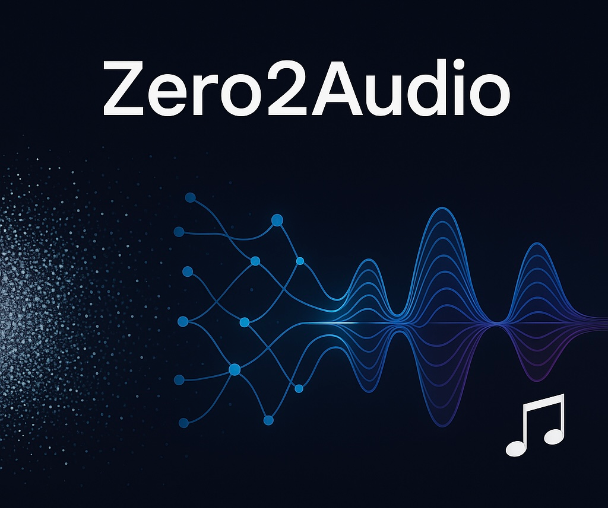

<table>
  <tr>
    <td>
      
    </td>
    <td>
      

        Educational, Simplified Implementations  
        To Widely-Used Audio/Music Deep Models  
        From Totally <strong>SCRATCH! </strong>
      

    </td>
  </tr>
</table>

  
---
### 🧩 Project Overview
Zero2Audio is an educational repository that implements a range of classic and interesting models and algorithms in audio and music processing, using the simplest possible approach.

In this repo, you’ll find:

-  Executable and interactive Jupyter notebooks

-  Modular implementations of core components from key models

-  Supplementary examples or visualizations when necessary

-  Each notebook is self-contained and functionally complete

### 🧠 What You Shouldn't Expect
This project does not aim to provide:

 - **Extensive theoretical discussions, motivations, or proofs**

   - It intentionally omits most in-depth textual explanations, as it focuses on well-established models and algorithms, and they are already widely available online. This repo is designed more as a practical complement to those readings.

 - **Full training pipelines or large-scale experiments**

   - Most models in this field require significant data and compute resources. To keep things lightweight and accessible, all notebooks use virtual or synthetic data, and no training is included.

 - **Complete engineering-level implementations**

   - It strips away auxiliary or production-related details to focus purely on the core logic. The implementations aim to be efficient and clear, though they may not always be optimal.

---

> [!NOTE] 
> This project is also the author's own journey into the audio domain. While great care has been taken to ensure correctness, errors or misinterpretations may exist. Feedback and corrections are warmly welcome!

---
### :cactus:Update Map
- [x] Wave2Vec 2.0
- [ ] HuBERT
- [ ] VQ-VAE
- [ ] Diffusion-based Audio Generation
- [ ] Transformer-based Audio Generation
- [ ] To-Be-Updated
